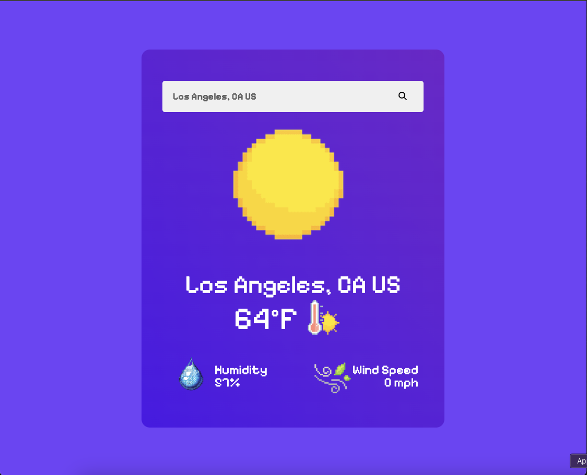

# 🌤 Weather App

## Description
This is a simple Weather App built with React and Vite, styled using Tailwind CSS. The app allows users to search for a city and displays the current weather conditions for the selected location. The search bar provides multiple results based on user input, making it easy to find the desired city. 

## Features
- 🌍 Search for any city worldwide
- 🔍 Auto-suggest multiple results in the search bar
- 🌡 Displays current temperature, weather conditions, and more
- 🎨 Fully responsive UI styled with Tailwind CSS

## Technologies Used
- React.js
- Vite
- Tailwind CSS
- OpenWeather API (or any other weather API)
- Font Awesome (for weather icons and UI enhancements)

## Installation
To run this project locally, follow these steps:

1. Clone the repository:
   ```sh
   git clone https://github.com/your-username/weather-app.git
   cd weather-app
   ```

2. Install dependencies:
   ```sh
   npm install
   ```

3. Install Tailwind CSS:
   ```sh
   npm install tailwindcss @tailwindcss/vite
   ```

4. Configure the Vite plugin for Tailwind CSS:
   Ensure your `vite.config.js` file is properly set up:
   ```js
   import { defineConfig } from 'vite'
   import tailwindcss from '@tailwindcss/vite'
   export default defineConfig({
    plugins: [
    tailwindcss(),
    ],
   })
   ```

5. Install Font Awesome (Free version):
   ```sh
   npm install --save @fortawesome/fontawesome-free
   ```

6. Start the development server:
   ```sh
   npm run dev
   ```

## Configuration
To fetch weather data, you need an API key from [OpenWeather](https://openweathermap.org/api) or another weather provider. Add your API key to an `.env` file:

```
VITE_WEATHER_API_KEY=your_api_key_here
```

Also include the following API urls in your `.env` file:

```
VITE_WEATHER_API_URL=https://api.openweathermap.org/data/2.5/weather
VITE_WEATHER_GEO_API_URL=https://api.openweathermap.org/geo/1.0/direct
```

## Usage
1. Type a city name in the search bar.
2. Select the desired city from the suggestions.
3. View the current weather conditions for that city by pressing the search icon.

## Screenshots



